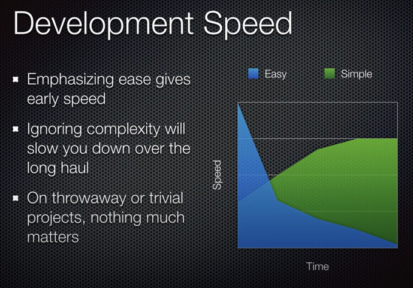

# fácil, sencillo, eficaz, eficiente

Dando vueltas a esta charla: ["Simple Made Easy" - Rich Hickey - 2011](https://www.youtube.com/watch?v=LKtk3HCgTa8)

## Facilidad frente a sencillez

En nuestros trabajos suele ser habitual priorizar la facilidad. Huyendo de la sencillez cuando esta entra en conflicto con la facilidad. Y sin contemplar para nada ni la eficacia ni la eficiencia. (Bueno, a lo sumo la eficacia… si consigue terminar el trabajo más fácilmente.)

- más FÁCIL => menor esfuerzo (en ese momento)
- más SENCILLO => menor complejidad (en conjunto)
- más EFICAZ => llegar antes a conseguir el resultado
- más EFICIENTE => llegar a conseguir el resultado con el menor coste

La facilidad y la sencillez, no están relacionadas con conseguir o no el resultado; son solo atributos del trabajo que se está realizando.

Si se piensa también en conseguir el resultado; es cuando se contemplan además la eficacia y la eficiencia.

## Proyectos vs procesos

Por otro lado, hay dos formas de encarar los trabajos:

- Como proyectos: se trata de planificar y hacer algo concreto. Cada proyecto es independiente.

- Como procesos continuos: se trata de mantener y evolucionar algo a lo largo del tiempo. Aquello que se hace en un momento determinado, tiene repercusiones más tarde.

Trabajando en proyectos, se considera resultado acabar lo previsto para este proyecto. Luego, si cabe, ya habrá más proyectos posteriores. Si se acaba cada proyecto, hay avance.

Trabajando en procesos, se considera resultado conseguir lo que se desea hacer ahora sin introducir complicaciones ni problemas para el futuro. Si van consiguiendo resultados y no se acumula deuda, hay avance.

Las personas que piensan en procesos. Cuando han de trabajar en proyectos. Tienen el problema de que ven la deuda que se va acumulando; ya que tienden a pensar en el siguiente proyecto como parte del anterior. De ahí que no vean avances tan notorios como si los ven las personas que solo piensan en proyectos. De ahí que intenten complicar el proyecto actual solicitando esfuerzos que, a priori, en un análisis superficial, no tienen nada que ver con lo que se está tratando concretamente en ese proyecto.

En un entorno donde se trabaje por proyectos. Es mejor ceñirse al proyecto entre manos. Tener claro que terminar cada proyecto, es avanzar. Cada proyecto terminado produce beneficios. Cuantos más proyectos haya en el futuro, más seguro se tendrá trabajo.

## La realidad

Pero la realidad es que el desarrollo e implantación de software es siempre un proceso continuo, nunca por proyectos. El software nace en su primer lanzamiento y va evolucionando durante toda su vida útil, hasta que es retirado.

En este escenario, se aplica lo que Rich Hickey comenta en la charla:

